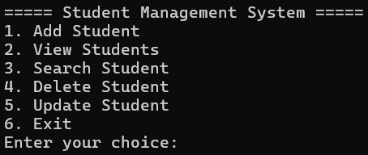

# Student Management System

A simple Java console-based application to manage student records using OOP concepts.

## Features
- Add Student
- View Students
- Search Student
- Delete Student
- Update Student

## Technologies Used
- Java
- OOP Concepts
- ArrayList
- Scanner Class

## How to Run

Compile:
javac Main.java Student.java

Run:
java Main

## Author
Koushik

## Output Screenshot

## Student Details
